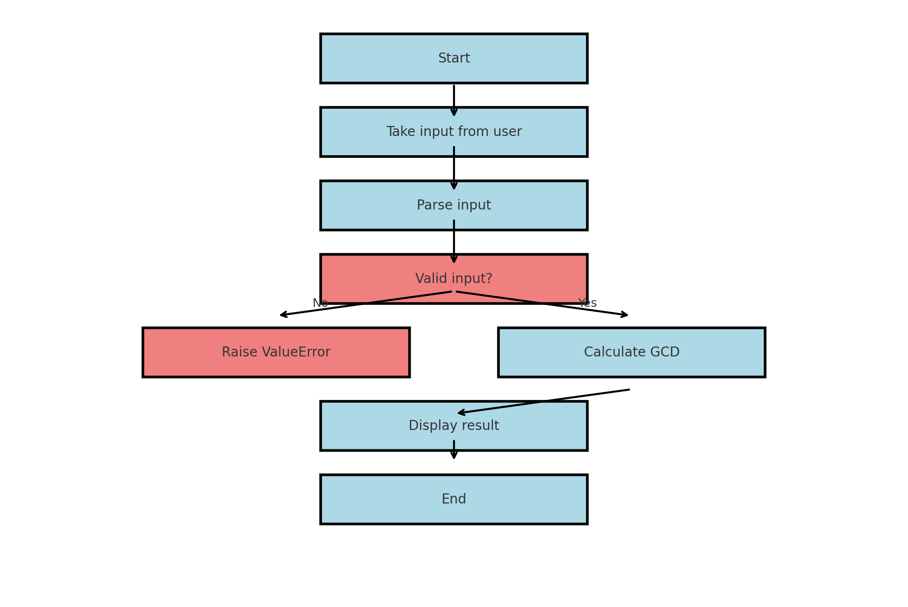

title: GGT-Rechner Flowchart
theme: White
class: center, middle

# GGT-Rechner
https://prezi.com/view/iesU2GPKZSnPB6MyqOtA/ 
---

## Überblick

- Ein Python-Programm zur Berechnung des größten gemeinsamen Teilers (GGT) einer Menge von Zahlen.
- Enthält Eingabevalidierung und Fehlerbehandlung.
- Schritt-für-Schritt-Ablauf.

---

## Übersicht des Flowcharts


---

## Schritte im Detail

### Schritt 1: Start
- Das Programm startet die Ausführung.

---

### Schritt 2: Eingabe vom Benutzer
- Fordert den Benutzer auf, Zahlen getrennt durch Leerzeichen einzugeben.

**Code-Schnipsel:**
```python
input_string = input("Geben Sie Zahlen getrennt durch Leerzeichen ein: ")
```

---

### Schritt 3: Eingabe parsen
- Konvertiert die Eingabezeichenfolge in eine Liste von Ganzzahlen.

**Code-Schnipsel:**
```python
numbers = parse_input(input_string)
```

---

### Schritt 4: Eingabe validieren
- Überprüft, ob die Eingabe gültige Ganzzahlen enthält.
- Falls ungültig, wird eine `ValueError` ausgelöst.

**Code-Schnipsel:**
```python
if not all(isinstance(x, int) for x in numbers):
    raise ValueError("Ungültige Eingabe. Bitte geben Sie nur ganze Zahlen ein.")
```

---

### Schritt 5: GGT berechnen
- Berechnet den GGT der gültigen Liste von Ganzzahlen.

**Code-Schnipsel:**
```python
result = calculate_gcd(numbers)
```

---

### Schritt 6: Ergebnis anzeigen
- Gibt den berechneten GGT an den Benutzer aus.

**Code-Schnipsel:**
```python
print(f"Der GGT von {numbers} ist {result}")
```

---

### Schritt 7: Fehler behandeln
- Gibt dem Benutzer Rückmeldung bei einem Eingabe- oder Berechnungsproblem.

**Code-Schnipsel:**
```python
except ValueError as e:
    print(e)
```

---

## Flowchart Zusammenfassung

- Der gesamte Programmablauf wird visuell zusammengefasst.


---

## Unit-Tests

- Das Programm enthält Unit-Tests zur Sicherstellung der Zuverlässigkeit.

**Tests beinhalten:**
- GGT für eine einzelne Zahl.
- GGT für mehrere Zahlen.
- GGT für Primzahlen.
- Umgang mit ungültigen oder leeren Eingaben.

**Code-Schnipsel:**
```python
class TestGCDCalculator(unittest.TestCase):
    def test_calculate_gcd_multiple_numbers(self):
        self.assertEqual(calculate_gcd([48, 72, 108]), 12)
```

---

## Fazit

- Dieses Programm zeigt effektives Eingabehandling, Berechnungslogik und Fehlerbehandlung zur Berechnung des GGTs.
- Es beinhaltet zudem Unit-Tests für Robustheit.

**Ende der Präsentation**
