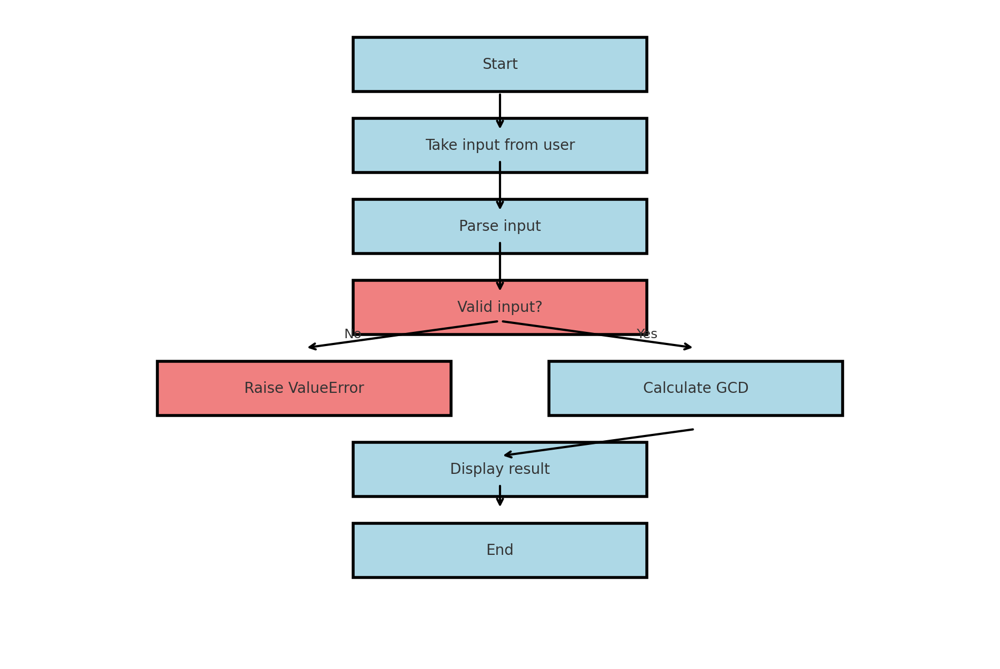

---
# Unser Projekt Greatest Common Divisor GCD

- [x] Grösster Gemeinsamer Teiler GGT oder in English Greatest Common Divisor GCD
- [x] Das Programm soll aus mindestens einer ganzen Zahl den GGT ausrechnen können 
- [x] Variablen und nicht ganze Zahlen sind nicht erlaubt
- [x] Es soll mit Python umgesetzt werden

---

# Detaillierte Erklärung der Testfälle in `Test_gcd.py`

## Überblick
Dieses Dokument bietet eine detaillierte Aufschlüsselung der Testfälle, die im Skript zur Validierung der Funktionalität des GCD-Rechners geschrieben wurden.

## Testfall-Aufschlüsselung

### 1. `test_calculate_gcd_single_number`
- **Zweck**: Sicherstellen, dass die GCD-Funktion eine einzelne Zahl korrekt verarbeiten kann.
- **Schritte**:
  1. Eingabe einer Liste mit einer einzigen Zahl `[7]`.
  2. Überprüfen, ob die Ausgabe `7` entspricht, da der GCD einer einzelnen Zahl die Zahl selbst ist.
- **Erwartetes Ergebnis**: `7`

### 2. `test_calculate_gcd_multiple_numbers`
- **Zweck**: Überprüfen, ob der GCD für mehrere Zahlen korrekt berechnet wird.
- **Schritte**:
  1. Eingabe einer Liste von Ganzzahlen `[48, 72, 108]`.
  2. Der GCD dieser Zahlen ist `12` (die größte Zahl, die alle drei ohne Rest teilt).
- **Erwartetes Ergebnis**: `12`

### 3. `test_calculate_gcd_prime_numbers`
- **Zweck**: Testen des Randfalls, bei dem die Eingabeliste nur Primzahlen enthält, die keinen gemeinsamen Teiler außer `1` haben.
- **Schritte**:
  1. Eingabe einer Liste von Primzahlen `[13, 17, 19]`.
  2. Da es keinen gemeinsamen Teiler außer `1` gibt, sollte der GCD `1` sein.
- **Erwartetes Ergebnis**: `1`

### 4. `test_calculate_gcd_empty_list`
- **Zweck**: Überprüfen, ob die Funktion eine leere Liste korrekt verarbeitet, indem sie eine `ValueError`-Ausnahme auslöst.
- **Schritte**:
  1. Eingabe einer leeren Liste `[]`.
  2. Erwartung, dass die Funktion eine `ValueError`-Ausnahme mit einer entsprechenden Fehlermeldung auslöst.
- **Erwartetes Ergebnis**: Eine `ValueError`-Ausnahme wird ausgelöst.

### 5. `test_validate_input_valid`
- **Zweck**: Sicherstellen, dass gültige Eingabestrings korrekt in Listen von Ganzzahlen umgewandelt werden.
- **Schritte**:
  1. Eingabe eines gültigen Strings `"48 72 108"`.
  2. Überprüfen, ob die Funktion die entsprechende Liste `[48, 72, 108]` zurückgibt.
- **Erwartetes Ergebnis**: `[48, 72, 108]`

### 6. `test_validate_input_invalid`
- **Zweck**: Sicherstellen, dass die Funktion einen Fehler auslöst, wenn der Eingabestring nicht-ganzzahlige Werte enthält.
- **Schritte**:
  1. Eingabe eines Strings `"48 abc 108"`, der ungültige Zeichen enthält.
  2. Erwartung, dass die Funktion eine `ValueError`-Ausnahme auslöst.
- **Erwartetes Ergebnis**: Eine `ValueError`-Ausnahme wird ausgelöst.

### 7. `test_validate_input_empty`
- **Zweck**: Überprüfen, ob die Funktion einen leeren Eingabestring korrekt verarbeitet.
- **Schritte**:
  1. Eingabe eines leeren Strings `""`.
  2. Erwartung, dass die Funktion eine `ValueError`-Ausnahme auslöst.
- **Erwartetes Ergebnis**: Eine `ValueError`-Ausnahme wird ausgelöst.

## Hinweise
- Diese Tests decken Randfälle, normale Fälle und Szenarien mit ungültigen Eingaben umfassend ab.
- Sie gewährleisten die Robustheit und Zuverlässigkeit der Funktionen `calculate_gcd` und `validate_input`.

---


# Erklärung des GCD-Berechnungsprogramms

Das folgende Python-Skript berechnet den **größten gemeinsamen Teiler (GGT)** einer Liste von Zahlen.

---

## **1. Importierte Module**
```python
from math import gcd
from functools import reduce
```
- **`gcd`**: Funktion aus dem Modul `math`, berechnet den GGT von zwei Zahlen.
- **`reduce`**: Aus dem Modul `functools`, um eine Funktion sukzessive auf eine Liste anzuwenden.

---

## **2. Funktion `calculate_gcd(numbers)`**
Diese Funktion berechnet den GGT einer Liste von Zahlen.

### **Signatur**
```python
def calculate_gcd(numbers):
```
### **Beschreibung**
- **Parameter:** `numbers` ist eine Liste von Ganzzahlen.
- **Rückgabe:** Der GGT der Liste.

### **Details**
#### Fehlerbehandlung:
```python
if len(numbers) == 0:
    raise ValueError('Numbers cannot be empty.')
```
- Leere Listen werden mit einem `ValueError` abgefangen.

#### Konvertierung und Validierung:
```python
try:
    numbers = map(int, numbers)
except ValueError:
    raise ValueError("Alle Eingaben muessen Ganzzahlen sein!.")
```
- Jedes Element wird in eine Ganzzahl konvertiert. Ungültige Werte lösen einen Fehler aus.

#### Berechnung des GGTs:
```python
return reduce(gcd, numbers)
```
- `reduce` wendet die `gcd`-Funktion sukzessive auf Paare in der Liste an.

---

## **3. Funktion `parse_input(input_string)`**
### **Signatur**
```python
def parse_input(input_string):
```
### **Beschreibung**
- Konvertiert die Eingabe (String) in eine Liste von Ganzzahlen.
- **Validierung:**
  - Prüft, ob die Eingabe leer ist.
  - Wandelt den String in Ganzzahlen um.
```python
if not input_string:
    raise ValueError("Eingabe darf nicht leer sein.")
```
- Fehlerhafte Eingaben lösen einen `ValueError` aus.

---

## **4. Hauptprogramm (`if __name__ == "__main__":`)**
```python
if __name__ == "__main__":
    try:
        input_string = input("Fügen Sie Ganzzahlen getrennt durch Leerzeichen ein: ").strip()
        numbers = parse_input(input_string)
        result = calculate_gcd(numbers)
        print(f"Der groesste gemeinsame Teiler von {numbers} ist {result}")
    except ValueError as e:
        print(f"Fehler: {e}")
```

### **Details**
1. **Benutzereingabe:**
   - Der Benutzer wird gebeten, Ganzzahlen (durch Leerzeichen getrennt) einzugeben.
   - Die Eingabe wird bereinigt, um führende oder nachfolgende Leerzeichen zu entfernen.

2. **Verarbeitung:**
   - Die Eingabe wird mit `parse_input` validiert.
   - Der GGT wird mit `calculate_gcd` berechnet.

3. **Ausgabe:**
   - Gibt den GGT der Zahlen aus.

4. **Fehlerbehandlung:**
   - Abfangen von Fehlern mit sinnvollen Fehlermeldungen.

---
## Flowchart des Programms Greatest Common Divisor



## **Zusammenfassung**
- Das Skript berechnet den GGT einer Zahlenliste.
- Es validiert die Eingabe und behandelt Fehler wie leere Eingaben oder ungültige Zeichen.


---
